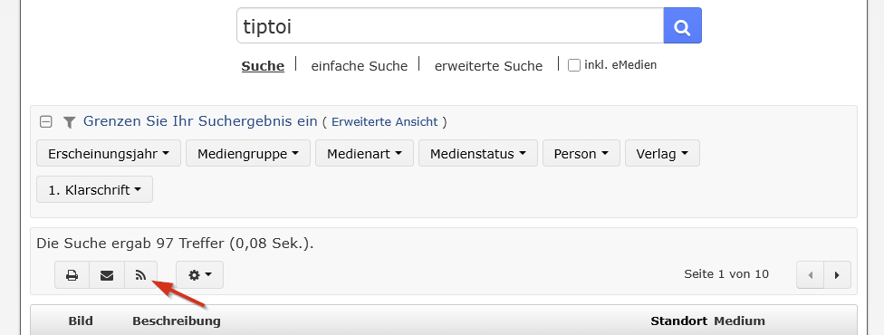

# tiptoi Library Sync for WinBIAP / OPAC

A PowerShell script for managing `.gme` audio files on a Ravensburger tiptoi volume using a library's WinBIAP/OPAC RSS search feed and the public Ravensburger tiptoi catalog.

The script can:

- identify local `.gme` files by their internal GME Product-ID,
- match library search results to Ravensburger tiptoi products,
- show whether a local file is owned, available from the library, ignored, or unknown,
- detect duplicate or size-mismatched GME files,
- download missing audio files,
- optionally filter downloads by Ravensburger's age recommendation,
- clean up ignored or unknown files interactively,
- and repair/re-download certain invalid local files.

> [!WARNING]
> This script is **mostly AI generated** and comes with **absolutely no warranties**.
> 
> The author makes no representation that the script is correct, safe, complete, suitable for a particular purpose, or compatible with any particular library, tiptoi device, filesystem, or future Ravensburger service.
>
> It has not undergone an in-depth review or comprehensive compatibility testing. It can download, replace, and delete files on the tiptoi volume. Read the code, keep backups, and use it entirely at your own risk.

This is an unofficial project and is not affiliated with or endorsed by Ravensburger.

## Requirements

- Windows PowerShell
- Internet access
- A mounted tiptoi volume containing the `.gme` files
- A WinBIAP/OPAC library catalog that exposes an RSS feed for search results

The script is intended to work with many WinBIAP/OPAC installations, but catalog layouts and RSS contents can differ between libraries. Compatibility is therefore not guaranteed.

## Installation

Rename the script to:

```text
tiptoi.ps1
```

and place it **directly on the tiptoi volume**, in the same directory in which the tiptoi `.gme` files are stored.

For example:

```text
E:\
├── tiptoi.ps1
├── ABC.gme
├── XYZ.gme
└── ...
```

The script deliberately uses its own directory as the working directory. Local GME scanning, downloads, temporary files, cleanup, and the optional `tiptoi_mybooks.yml` file therefore all refer to the directory containing `tiptoi.ps1`.

## Configure the library RSS feed

The included RSS URL is only an example and **must be replaced with the RSS URL of your own library search**.

Open `tiptoi.ps1` in a text editor and find:

```powershell
$LibraryRssUrl =
    "https://opac.winbiap.net/..."
```

Replace the complete URL with the RSS URL copied from your library's search results.

### How to find the RSS URL

A typical WinBIAP/OPAC workflow is:

1. Open your library's online catalog.
2. Search for `tiptoi`.
3. Apply any filters you want the script to use.
4. On the result page, look for the **RSS icon**. It is often located near the result count and the print/e-mail controls.
5. Copy the link target / URL of that RSS icon.
6. Paste that URL into `$LibraryRssUrl` in `tiptoi.ps1`.

Example:



The RSS feed represents the library titles the script considers available. If you change the search or filters in the catalog, copy the corresponding RSS URL again.

## Basic usage

Run the script from PowerShell, for example:

```powershell
.\tiptoi.ps1
```

Without an action parameter, the script scans the local GME files and prints a table containing Product-ID, filename, title, availability, file status, and size.

Typical examples:

```powershell
# Show the local collection
.\tiptoi.ps1

# Sort the listing by file size instead of Product-ID
.\tiptoi.ps1 -sort Size

# Show only files whose availability is unknown
.\tiptoi.ps1 -excludeListed

# Ask individually before downloading each missing library title
.\tiptoi.ps1 -download

# Same as above, explicitly
.\tiptoi.ps1 -download Ask

# Download all missing candidates without individual confirmation
.\tiptoi.ps1 -download All

# Only consider titles suitable for age 5
.\tiptoi.ps1 -download -age 5

# Offer ignored files for deletion
.\tiptoi.ps1 -cleanup

# Explicit equivalent
.\tiptoi.ps1 -cleanup Ignored

# Offer ignored and unknown files for deletion
.\tiptoi.ps1 -cleanup All

# Try to repair duplicate / incorrectly sized local files
.\tiptoi.ps1 -fix
```

## Parameters

| Parameter | Values | Default / behavior |
|---|---|---|
| `-download` | `Ask`, `All` | `Ask`. `-download` by itself asks for every download candidate. `-download All` skips those individual questions. |
| `-cleanup` | `Ignored`, `All` | `Ignored`. `-cleanup` by itself offers ignored files. `All` additionally offers files with status `Unbekannt`. |
| `-age` | `0`–`99` | Optional. Only affects download mode. |
| `-fix` | switch | Interactively checks/repairs duplicate or incorrectly sized GME files. |
| `-sort` | `Id`, `Size` | `Id`. `Size` sorts the normal listing by descending file size. |
| `-excludeListed` | switch | In the normal listing, show only files with availability status `Unbekannt`. |

### Download modes

`-download` uses `Ask` by default.

In `Ask` mode the script shows, for each missing download candidate:

- title,
- ISBN,
- GME Product-ID,
- Ravensburger age recommendation,
- file size,

and asks whether the file should actually be downloaded.

This selection happens **before the required free disk space is calculated**. Rejected candidates therefore do not count toward the required space.

Use:

```powershell
.\tiptoi.ps1 -download All
```

to skip the per-file confirmation.

If the selected downloads require more free space than is available, the script can interactively offer eligible local files for deletion.

## `tiptoi_mybooks.yml`

An optional file named:

```text
tiptoi_mybooks.yml
```

can be placed **next to `tiptoi.ps1` on the tiptoi volume**.

It contains two lists:

- `mine` — tiptoi titles you own and want to keep
- `ignore` — titles that should not be downloaded and may be offered for cleanup

Example:

```yaml
mine:
 - isbn: 978-3-473-32909-0 # Optional comment / title
 - isbn: 9783473329100
 - id: 923

ignore:
 - isbn: 978-3-473-32911-0 # Optional comment / title
 - isbn: 9783473329120
 - id: 924
```

### YAML entry syntax

Each item may use either:

```yaml
- isbn: 978-3-473-32909-0
```

or:

```yaml
- id: 923
```

ISBN separators such as hyphens are optional.

Comments beginning with `#` are allowed:

```yaml
- isbn: 978-3-473-32909-0 # My copy of this book
```

`id` refers to the **internal GME Product-ID**, not necessarily the printed Ravensburger article number.

The parser is intentionally small and only supports the simple structure shown above. It is not a general-purpose YAML parser.

For backward compatibility, the script also accepts the old root key `my_books` as an alias for `mine`. The misspelling `ingore` is accepted as an alias for `ignore`, but new files should use `mine` and `ignore`.

## Availability status

Local files are classified in this priority order:

| Status | Meaning |
|---|---|
| `Ignoriert` | The Product-ID is listed under `ignore`. This takes precedence over all other availability states. |
| `Besitz` | The Product-ID is listed under `mine`. |
| `Bücherei` | The Product-ID was resolved from the configured library RSS feed. |
| `Unbekannt` | None of the above applies. |

An ignored title is not downloaded even if it is present in the library RSS feed.

When additional space is required for downloads, files with status `Ignoriert` or `Unbekannt` may be offered for deletion. Files with status `Besitz` or `Bücherei` are not used as automatic space-recovery candidates.

## Cleanup mode

Cleanup candidates are always offered in **descending file-size order**.

```powershell
.\tiptoi.ps1 -cleanup
```

or:

```powershell
.\tiptoi.ps1 -cleanup Ignored
```

offers only files with status `Ignoriert`.

```powershell
.\tiptoi.ps1 -cleanup All
```

offers files with status:

- `Ignoriert`
- `Unbekannt`

Every deletion still requires confirmation.

## Age filtering

Age filtering is only applied in download mode:

```powershell
.\tiptoi.ps1 -download -age 6
```

The script uses the Ravensburger catalog's `ageFrom` and `ageTo` fields.

If only one limit is available, the missing limit is treated as:

- missing `ageFrom` → `0`
- missing `ageTo` → `99`

If both are missing, the title is not excluded by the age filter.

## Local file checks

During the normal listing the script checks local files for:

- duplicate GME Product-IDs,
- file-size differences compared with the server version.

Typical file statuses are:

- `OK`
- `Duplikat`
- `Falsche Größe`
- `Nicht prüfbar`

Use:

```powershell
.\tiptoi.ps1 -fix
```

for the interactive repair workflow.

## Temporary downloads

Downloads are first written to temporary files ending in:

```text
.download
```

If `-download` is started and stale `*.download` files from an earlier run are found, the script offers to delete them before continuing.

## Notes and limitations

Matching library records to Ravensburger files is based on ISBN/EAN information, Ravensburger catalog metadata, and title matching where required. Not every OPAC record can necessarily be resolved unambiguously.

The script intentionally continues with successfully resolved library entries when some RSS entries cannot be mapped. Pay attention to warnings, especially before deleting local files.

Because both WinBIAP installations and Ravensburger's online services can change, future changes may break parts of the script without notice.
